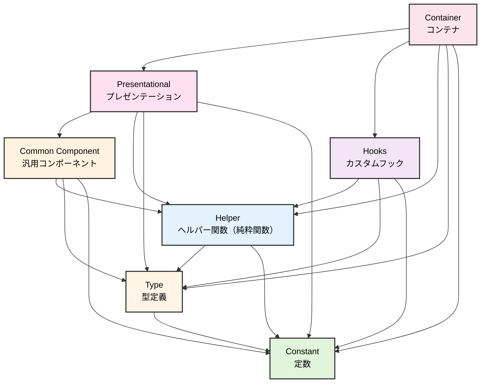

## はじめに

React(Next.js)のプロジェクトでアーキテクチャ設計を模索し続けた結果、**関数型プログラミングの思想**を基盤にした設計に辿り着きました。

フロントエンド開発では、ロジックとUIが混在しがちで、テストが書きにくく、変更の影響範囲が読めないという課題がつきまといます。この記事では、これらの課題に対して私たちがどのようなアプローチを取ったのかを、ユーザー管理アプリケーションを例にしながら解説します。

## TL;DR

- テスト容易性の高いContainer/Presentationalパターンを採用した
- 関数型アーキテクチャの思想を取り入れた
- 最大限のコロケーションを意識した
- テスト駆動開発を導入した
- Orvalを導入し、API準拠のクライアントを使用するようにした

## 関数型アーキテクチャ

### 関数型アーキテクチャの概要

本設計の土台となっているのが、**関数型アーキテクチャ**の考え方です。

関数型アーキテクチャでは、アプリケーションを**Functional Core（関数型コア）**と**Imperative Shell（命令型シェル）**の2層に分けて設計します。

- **Functional Core（関数型コア）**: 純粋関数で構成されるビジネスロジック。同じ入力に対して常に同じ出力を返し、副作用を持たない
- **Imperative Shell（命令型シェル）**: 外部とのやり取り（API呼び出し、状態管理、DOM操作など）を担当する薄いラッパー

この2層構造の最大のメリットは、**テスト容易性**です。純粋関数であるFunctional Coreはモックなしで簡単にテストでき、副作用を持つImperative Shellは薄く保つことでテストの複雑さを最小化できます。

このアーキテクチャの核となる原則は以下の3つです。

**1. イミュータビリティ（最重要）**

オブジェクトを直接変更せず、常に新しいオブジェクトを作成します。

```typescript
// ❌ NG: 直接変更
user.name = newName;
users.push(newUser);

// ✅ OK: スプレッド演算子で新しいオブジェクトを作成
const updatedUser = { ...user, name: newName };
const updatedUsers = [...users, newUser];
```

**2. 純粋関数を優先**

副作用を持たず、同じ入力に対して常に同じ出力を返す関数を優先します。

```typescript
// ✅ 純粋関数: テスト容易
const calculateTotal = (items: readonly Item[]): number =>
  items.reduce((sum, item) => sum + item.price, 0);
```

**3. 宣言的記述**

```typescript
// ❌ 命令的
const results = [];
for (const item of items) {
  if (item.active) {
    results.push(item.name);
  }
}

// ✅ 宣言的
const results = items
  .filter((item) => item.active)
  .map((item) => item.name);
```

:::message
**参考資料**
- [関数型プログラミングとは](https://zenn.dev/michiharu/articles/6f50e80d0eb818)
- [Humble Objectパターン（Martin Fowler）](https://martinfowler.com/bliki/HumbleObject.html)
- [Next.jsにおけるContainer/Presentationalパターン](https://zenn.dev/akfm/books/nextjs-basic-principle/viewer/part_2_container_presentational_pattern)
:::

### Reactへの適用: Container/Presentationalパターン

この関数型アーキテクチャをReactのコンポーネント設計に当てはめたのが、**Container/Presentationalパターン**です。

| 関数型アーキテクチャ | React コンポーネント | 役割 |
|---|---|---|
| **Imperative Shell（命令型シェル）** | **Container** | 副作用の集約（API呼び出し、状態管理、イベントハンドラ） |
| **Functional Core（関数型コア）** | **Presentational, Helper** | 純粋関数としてのUI描画・データ変換 |

つまり、**Containerは命令型シェル**として副作用を一手に引き受け、**Presentationalは関数型コア**としてpropsのみに依存する純粋関数のまま保たれます。ヘルパー関数もまた関数型コアの一部として、純粋関数で構成されます。

たとえば、ユーザー一覧画面を作る場合を考えてみましょう。

```tsx
// user-list.container.tsx — Imperative Shell（命令型シェル）
export const UserListContainer = () => {
  // 副作用: API呼び出し、状態管理
  const { data: users, isLoading } = useFetchUsers();
  const [searchQuery, setSearchQuery] = useState("");

  // Functional Coreの呼び出し
  const filteredUsers = filterUsersByQuery(users, searchQuery);

  // Presentational（関数型コア）にデータを渡す
  return (
    <UserListPresentational
      users={filteredUsers}
      isLoading={isLoading}
      searchQuery={searchQuery}
      onSearchQueryChange={setSearchQuery}
    />
  );
};

// Functional Core（関数型コア）: 純粋関数として定義
const filterUsersByQuery = (
  users: readonly User[],
  query: string,
) => {
  if (!query) return users;
  return users.filter((user) =>
    user.name.toLowerCase().includes(query.toLowerCase()),
  );
};
```

```tsx
// user-list.presentational.tsx — Functional Core（関数型コア）
// propsのみに依存する純粋関数
interface UserListPresentationalProps {
  users: readonly { id: string; name: string; email: string }[];
  isLoading: boolean;
  searchQuery: string;
  onSearchQueryChange: (query: string) => void;
}

export const UserListPresentational = ({
  users,
  isLoading,
  searchQuery,
  onSearchQueryChange,
}: UserListPresentationalProps) => {
  if (isLoading) return <Spinner />;

  return (
    <div>
      <SearchInput value={searchQuery} onChange={onSearchQueryChange} />
      {users.map((user) => (
        <UserCard key={user.id} name={user.name} email={user.email} />
      ))}
    </div>
  );
};
```

Presentationalは関数型コアなので、propsを渡すだけでUIの検証ができます。APIのモックやストアのセットアップは不要です。一方、Containerは命令型シェルとして副作用を集約しているため、結合テストでユーザー操作の一連の流れを検証します。

### フォルダ構成

Container/Presentationalパターンをプロジェクトに適用する際のフォルダ構成は以下のようになります。

```
src/app/users/                        # ページルート
├── page.tsx                          # ページコンポーネント（URLパラメータの受け渡し等）
├── _components/                      # ページ固有のコンポーネント群
│   └── user-list/                    # コンテナフォルダ
│       ├── user-list.container.tsx   # Container層
│       ├── user-list.presentational.tsx # Presentational層
│       ├── _shared/                  # コンテナフォルダ内で共有するコンポーネント
│       │   └── user-card/
│       ├── user-detail/              # 子コンテナフォルダ
│       │   ├── user-detail.container.tsx
│       │   ├── user-detail.presentational.tsx
│       │   └── index.ts
│       └── index.ts                  # バレルエクスポート
└── _shared/                          # ページ全体で共有する要素
    ├── constants.ts
    ├── types.ts
    └── helpers.ts
```

ポイントは、**クライアント側で依存関係にあるひとまとまり**をコンテナフォルダとして管理することです。`page.tsx`の責務はURLパラメータの受け取りとメタ情報の設定に限定し、ロジックは`_components/`配下のContainerに委譲します。

また、再利用可能な汎用コンポーネントは `src/components/` に、全ページで共有されるユーティリティは `src/libs/` に配置します。

```
src/components/                       # 再利用可能な汎用コンポーネント
├── common/                           # 汎用UI（Button, Dialogなど）
└── features/                         # 特定機能に特化したコンポーネント

src/libs/                             # 全体共有のユーティリティ
├── api/                              # API関連（自動生成コード含む）
├── helpers/                          # ビジネスロジックを含む補助関数（純粋関数）
├── hooks/                            # 再利用できるカスタムフック
├── types/                            # 型定義
└── constants/                        # 定数定義
```

### 依存関係

モジュール間の依存方向を一方向に制限することで、循環依存を防ぎ、保守性を高めています。



重要なルールをまとめると以下のとおりです。

| 種別 | 依存できる対象 | 特徴 |
|---|---|---|
| Constant（定数） | なし | どこにも依存しない |
| Type（型定義） | Constant | 定数のみに依存 |
| Helper（ヘルパー関数） | Constant, Type | **純粋関数限定** |
| Hooks（カスタムフック） | Constant, Type, Helper | 状態管理を含む非純粋関数 |
| Presentational | Common Component, Helper, Type, Constant | **副作用を持たない純粋関数** |
| Container | Presentational, Hooks, Helper, Type, Constant | **副作用を集約する命令型シェル** |

特に重要なのは、**PresentationalからContainerを呼び出してはいけない**という点です。これを守ることで、テスタビリティとサーバー/クライアントコンポーネントの境界が明確になります。

### コロケーション

コロケーションとは、**関連するコードをできるだけ近くに配置する**という原則です。

たとえば、ユーザー一覧画面でのみ使う型定義やヘルパー関数があるなら、`src/libs/`に置くのではなく、そのコンポーネントのフォルダ内に配置します。

```
// ❌ 避けるべき: 使う場所から遠い
src/libs/types/user-list.ts
src/libs/helpers/filter-users.ts
src/app/users/_components/user-list/user-list.container.tsx

// ✅ 推奨: 使う場所の近くに配置
src/app/users/_components/user-list/
├── user-list.container.tsx
├── user-list.presentational.tsx
├── types.ts           # このコンテナフォルダでのみ使う型
└── filter-users.ts    # このコンテナフォルダでのみ使うヘルパー
```

この原則を守ることで、**変更の影響範囲として考慮しなければならないコード量**を最小化できます。複数のコンテナフォルダから共有される場合は、`_shared/`ディレクトリに移動させますが、安易にスコープを広げないことが重要です。

### カスタムフックとの共存

「ロジックの分離にはカスタムフックを使えばいいのでは？」という疑問があるかもしれません。実際、カスタムフックはロジックの再利用に有効ですが、Container/Presentationalパターンとは**役割が異なります**。

| 観点 | カスタムフック | Container/Presentational |
|---|---|---|
| 目的 | ロジックの再利用 | ロジックとUIの分離 |
| テスタビリティ | フック単体のテストが可能 | UIを純粋関数としてテスト可能 |
| 再利用性 | 複数コンポーネントで再利用可能 | ページ固有のロジックを整理 |

本設計では、**再利用されるロジック**はカスタムフックとして `src/libs/hooks/` や `_shared/` に切り出し、**ページ固有のロジック**はContainerに集約する形で共存させています。

```tsx
// src/libs/hooks/use-pagination.ts
// 複数画面で再利用するページネーションロジック
export const usePagination = (totalItems: number, itemsPerPage: number) => {
  const [currentPage, setCurrentPage] = useState(1);
  const totalPages = Math.ceil(totalItems / itemsPerPage);
  return { currentPage, totalPages, setCurrentPage };
};

// user-list.container.tsx
// ページ固有のロジックはContainerに集約
export const UserListContainer = () => {
  const { data: users } = useFetchUsers();
  const { currentPage, totalPages, setCurrentPage } = usePagination(
    users.length,
    20,
  );

  // ページ固有のフィルタリングロジック等
  const displayUsers = sliceForPage(users, currentPage, 20);

  return (
    <UserListPresentational
      users={displayUsers}
      currentPage={currentPage}
      totalPages={totalPages}
      onPageChange={setCurrentPage}
    />
  );
};
```

### ロジックのスコープ極小化

Containerコンポーネントが肥大化してきた場合、**親Containerから複数の子Containerを呼び出す**形で分割します。

```tsx
// user-management.container.tsx（親Container）
export const UserManagementContainer = () => {
  const { data: users } = useFetchUsers();
  if (!users) return null;

  return (
    <div className="flex flex-col gap-4">
      <UserSearchContainer users={users} />
      <UserTableContainer users={users} />
      <UserCreateDialogContainer />
    </div>
  );
};
```

各子Containerがそれぞれのスコープ内でロジックを完結させるため、ロジックの見通しが良くなります。

さらに、**Containerコンポーネント内で純粋関数を「関数型コア」として同一ファイルに定義する**パターンが使い勝手が良いです。

```tsx
// user-table.container.tsx
export const UserTableContainer = ({ users }: UserTableContainerProps) => {
  const [sortKey, setSortKey] = useState<SortKey>("name");
  const [sortOrder, setSortOrder] = useState<SortOrder>("asc");

  // Imperative Shell: 副作用を含むハンドラ
  const handleSort = (key: SortKey) => {
    if (key === sortKey) {
      setSortOrder((prev) => (prev === "asc" ? "desc" : "asc"));
    } else {
      setSortKey(key);
      setSortOrder("asc");
    }
  };

  const sortedUsers = sortUsers(users, sortKey, sortOrder);

  return (
    <UserTablePresentational
      users={sortedUsers}
      sortKey={sortKey}
      sortOrder={sortOrder}
      onSort={handleSort}
    />
  );
};

/**
 * Functional Core: 純粋関数
 * Container内のImperative Shellから呼び出されるためだけの関数
 * 汎用的に使用できるものは別ファイル（ヘルパー）に分離してもOK
 */
const sortUsers = (
  users: readonly User[],
  key: SortKey,
  order: SortOrder,
) => {
  return [...users].sort((a, b) => {
    const comparison = a[key] < b[key] ? -1 : a[key] > b[key] ? 1 : 0;
    return order === "asc" ? comparison : -comparison;
  });
};
```

このように、Containerファイル内に副作用を含む「命令型シェル」部分と、純粋関数の「関数型コア」部分を明確に分けて書くことで、テスト対象が明確になります。`sortUsers` のような純粋関数はexportすれば単体テストが容易に書けますし、Container自体は結合テストで検証します。

また、ロジックのスコープを小さく保つ上で**高階関数パターン**が非常に使い勝手が良いです。たとえば、テストヘルパーやMSWのハンドラセットアップなど、「共通の処理の中に個別のロジックを差し込みたい」場面で威力を発揮します。

```typescript
// MSWハンドラのセットアップを高階関数で抽象化
const setupMockHandler = (
  overrideHandler?: (params: { id: string }) => Response,
) => {
  server.use(
    http.get("*/api/users/:id", ({ params }) => {
      if (overrideHandler) {
        return overrideHandler({ id: params.id as string });
      }
      return HttpResponse.json({ id: params.id, name: "テストユーザー" });
    }),
  );
};

// テストごとに振る舞いを差し替えられる
setupMockHandler(); // デフォルトの正常系
setupMockHandler(() => HttpResponse.json({ error: "Not Found" }, { status: 404 })); // エラー系
```

```typescript
// renderHook + waitFor のパターンを高階関数で抽象化
const renderAndWait = async (ids: string[]) => {
  const { result } = renderHook(() => useFetchUsers(ids), { wrapper });
  await waitFor(() => expect(result.current.isLoading).toBe(false));
  return result;
};

// テストケースが簡潔になる
it("単一のIDでユーザーを取得できる", async () => {
  setupMockHandler();
  const result = await renderAndWait(["001"]);
  expect(result.current.data).toHaveLength(1);
});
```

高階関数で共通処理を抽象化することで、テストコードの重複を排除しつつ、各テストケースが「何をテストしているか」に集中できるようになります。この考え方はテストに限らず、Containerのイベントハンドラ構築など、あらゆる場面で応用可能です。

## APIとの連携

### APIクライアントの自動生成

本設計では、OpenAPIスキーマからAPIクライアントを自動生成する**Orval**を導入しています。

Orvalを使うことで、以下のメリットがあります。

- **型安全なAPIクライアント**: スキーマ定義に基づいた型が自動生成される
- **React Query連携**: カスタムフック形式のAPIクライアントが自動生成され、キャッシュやローディング状態の管理が簡単になる
- **MSWモック**: テスト用のモックハンドラも自動生成されるため、テスト作成のコストが下がる

```typescript
// Orvalが自動生成するコード（イメージ）
// libs/api/__generated__/users/users.ts
export const useGetUsers = () => {
  return useQuery({
    queryKey: ["users"],
    queryFn: () => fetchUsers(),
  });
};
```

### 依存関係逆転

ただし、自動生成されたコードにアプリケーション全体が直接依存すると、**APIスキーマの変更がアプリケーション全体に波及**してしまいます。

そこで、**依存関係逆転の原則（DIP）**を適用し、自動生成コードとアプリケーションの間に抽象層を設けます。

```typescript
// ❌ 禁止: 自動生成された型を直接インポート
import type { UserResponse } from "@/libs/api/__generated__/users.schemas";

// ✅ 推奨: アプリケーション固有の型定義を経由
import type { User } from "@/libs/types/user";
```

```typescript
// src/libs/types/user.ts
// 自動生成型をここで一度受けてから、アプリケーション向けの型として公開する
import type { UserResponse } from "@/libs/api/__generated__/users.schemas";

export type User = UserResponse;
```

この抽象層を設けることで、APIスキーマが変更された場合でも、影響範囲を`src/libs/types/`に限定できます。

この考え方はコンポーネント設計にも応用されています。Presentationalコンポーネントでは、**Propsのinterfaceにベタ書きで型を定義**することで、上位層（ContainerやAPI型）への依存を最小化します。

```tsx
// user-card.presentational.tsx
// ❌ 避けるべき: 外部の型にオブジェクト全体で依存
interface UserCardProps {
  user: User; // 不要なプロパティまで含まれてしまう
}

// ✅ 推奨: 必要なプロパティのみを定義（インターフェース分離の原則）
interface UserCardProps {
  name: string;
  email: string;
  avatarUrl: string;
}
```

Presentationalが「必要なものだけ」を受け取る設計にすることで、テスト時のモックデータも最小限で済み、再利用性も高まります。

## テスト駆動開発

本設計ではテスト駆動開発（TDD）を導入しています。テストの役割を大きく分けると以下のようになります。

- **単体テスト**: 作成したモジュールが正しく動作するか、仕様漏れがないかを検証する
- **結合テスト**: アプリケーションとしての機能に不備がないかを検証する

そしてもう一つ、テストには**設計のガードレール**としての側面もあります。たとえば、Presentationalのテストを書こうとしたときに「APIのモックが必要になる」「グローバルな状態をセットアップしないと動かない」と感じたら、それはPresentationalに副作用が混入しているサインです。テストが書きにくいという感覚が、設計の逸脱に気づくきっかけになります。逆に言えば、テストをスムーズに書けている状態は、Container/Presentationalの分離がうまく機能している証拠でもあります。

Container/Presentationalパターンとの組み合わせにより、テスト対象と手法が明確に分かれます。

### 単体テスト

単体テストの対象は、**ヘルパー関数**と**Presentationalコンポーネント**です。いずれも純粋関数（またはそれに近い存在）なので、モック不要でテストが書けます。

**ヘルパー関数のテスト**では、データ駆動テスト形式を推奨しています。テストケースをオブジェクト配列として定義し、`it.each`で展開します。

```typescript
import { describe, expect, it } from "vitest";
import { filterUsersByQuery } from "./filter-users";

/** @see {@link filterUsersByQuery} */
describe("filterUsersByQuery", () => {
  const MOCK_USERS = [
    { id: "1", name: "田中太郎", email: "tanaka@example.com" },
    { id: "2", name: "佐藤花子", email: "sato@example.com" },
    { id: "3", name: "鈴木一郎", email: "suzuki@example.com" },
  ] as const;

  const TEST_CASES = [
    {
      title: "検索クエリが空の場合、全ユーザーを返す",
      args: { users: MOCK_USERS, query: "" },
      expected: MOCK_USERS,
    },
    {
      title: "名前に一致するユーザーのみを返す",
      args: { users: MOCK_USERS, query: "田中" },
      expected: [MOCK_USERS[0]],
    },
    {
      title: "一致するユーザーがいない場合、空配列を返す",
      args: { users: MOCK_USERS, query: "山田" },
      expected: [],
    },
  ];

  it.each(TEST_CASES)("$title", ({ args, expected }) => {
    expect(filterUsersByQuery(args.users, args.query)).toEqual(expected);
  });
});
```

この形式のメリットは、**テストケース一覧が関数の仕様書**として機能する点です。追加や変更も配列への操作だけで完結します。

**Presentationalコンポーネントのテスト**では、props に応じた表示切り替え、イベントハンドラの呼び出しなどを検証します。

```typescript
import { render, screen } from "@testing-library/react";
import userEvent from "@testing-library/user-event";
import { describe, expect, it, vi } from "vitest";
import { UserListPresentational } from "./user-list.presentational";

const DEFAULT_PROPS = {
  users: [{ id: "1", name: "田中太郎", email: "tanaka@example.com" }],
  isLoading: false,
  searchQuery: "",
  onSearchQueryChange: vi.fn(),
};

const renderComponent = (overrideProps = {}) => {
  return render(
    <UserListPresentational {...DEFAULT_PROPS} {...overrideProps} />,
  );
};

describe("UserListPresentational", () => {
  describe("表示テスト", () => {
    it("ユーザー名が表示される", () => {
      renderComponent();
      expect(screen.getByText("田中太郎")).toBeInTheDocument();
    });

    it("ローディング中はスピナーが表示される", () => {
      renderComponent({ isLoading: true });
      expect(screen.getByRole("status")).toBeInTheDocument();
    });
  });
});
```

### 結合テスト

結合テストの対象は**Containerコンポーネント**です。Containerが内部のPresentationalと連携して正しく動作することを、**ユーザー視点の振る舞い**として検証します。

```typescript
import { render, screen } from "@testing-library/react";
import userEvent from "@testing-library/user-event";
import { http, HttpResponse } from "msw";
import { server } from "@/libs/mocks/setup/client/server";

describe("UserListContainer", () => {
  it("検索クエリを入力するとユーザー一覧がフィルタリングされる", async () => {
    const user = userEvent.setup();

    server.use(
      http.get("*/api/users", () => {
        return HttpResponse.json([
          { id: "1", name: "田中太郎", email: "tanaka@example.com" },
          { id: "2", name: "佐藤花子", email: "sato@example.com" },
        ]);
      }),
    );

    render(<UserListContainer />);

    // ユーザー一覧が表示されるまで待機
    expect(await screen.findByText("田中太郎")).toBeInTheDocument();
    expect(screen.getByText("佐藤花子")).toBeInTheDocument();

    // 検索クエリを入力
    const searchInput = screen.getByRole("textbox");
    await user.type(searchInput, "田中");

    // フィルタリング結果を確認
    expect(screen.getByText("田中太郎")).toBeInTheDocument();
    expect(screen.queryByText("佐藤花子")).not.toBeInTheDocument();
  });
});
```

ここで重要なのは、**APIのモックにはMSW（Mock Service Worker）を使用し、ネットワークレベルでモック**する点です。`vi.mock()`で内部実装をモックするのではなく、MSWで実際のHTTPリクエストをインターセプトすることで、リファクタリングへの耐性が高まります。

### ContainerとPresentationalのテスト境界

Container/Presentationalパターンでは、テストの境界が明確に分かれます。

| テスト対象 | テスト種別 | 検証内容 |
|---|---|---|
| Helper（ヘルパー関数） | 単体テスト | 入出力の正しさ |
| Presentational | 単体テスト | propsに応じた表示切り替え、イベントハンドラの呼び出し |
| Container | 結合テスト | ユーザー操作 → 状態変更 → 表示更新の一連の流れ |

**見分け方のポイント:**

- **Presentationalでテストする**: propsの値に応じた表示切り替え、コンポーネント内の `map`/`filter` などの表示ロジック
- **Containerでテストする**: 状態管理との連携、データの加工・変換、API連携、ビジネスロジック

たとえば、「権限に応じてメールアドレスをマスクする」というロジックがContainerにある場合、マスク処理自体はContainerのテストで検証し、「マスクされた値が`null`の場合に非表示になる」という表示ロジックはPresentationalのテストで検証します。

### E2Eテスト

E2Eテストは以下の目的で使用します。

- **ページ遷移を伴うテスト**: 画面間のナビゲーションやURLパラメータの引き継ぎが正しく動作するか
- **主要導線のリグレッション対策**: ユーザーが最も利用する重要なフロー（一覧 → 詳細 → 編集 → 保存など）が壊れていないことを保証
- **ビジュアルリグレッションテスト**: UIの意図しない変化を検知

単体テストや結合テストでは検証できない、**画面をまたいだ統合的な動作確認**に限定して使用します。

### テスト実行

テストフレームワークにはVitestを使用しています。テストは常に`run`モード（ワンショット実行）で実行し、watchモードは使用しません。

```bash
# テスト実行
pnpm test

# 特定のファイルのみ
pnpm test -- user-list.container.test.tsx
```

## その他

### ライブラリのラップ

外部ライブラリは原則として**ラップして使用**します。ライブラリ固有の仕様を隠蔽し、将来的な差し替えに備えるためです。

ただし、すべてのライブラリをラップするわけではなく、差し替えの現実性に応じて判断します。

| 分類 | ラップ | 理由 |
|---|---|---|
| ユーティリティ系（date-fns, lodashなど） | 必要 | 将来的な差し替えに備える |
| フォーム/バリデーション系（React Hook Form, zodなど） | 不要 | コンポーネントと密結合で差し替え困難 |
| 状態管理系（Zustand, TanStack Queryなど） | 不要 | アプリ全体に影響し、差し替えが現実的でない |

たとえば、日付操作ライブラリであれば、以下のようにラップします。

```typescript
// src/libs/helpers/date.ts
import { format, addDays } from "date-fns";

export const formatDate = (date: Date, pattern: string) =>
  format(date, pattern);

export const addDaysToDate = (date: Date, days: number) =>
  addDays(date, days);
```

こうすることで、仮にdate-fnsからdayjsに移行する場合でも、変更は `src/libs/helpers/date.ts` の内部実装のみで済み、呼び出し側のコードは一切変更不要になります。
